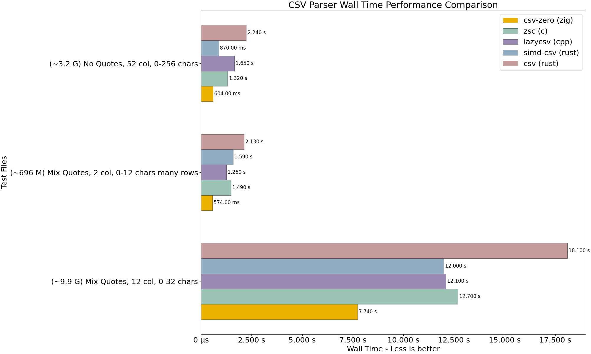
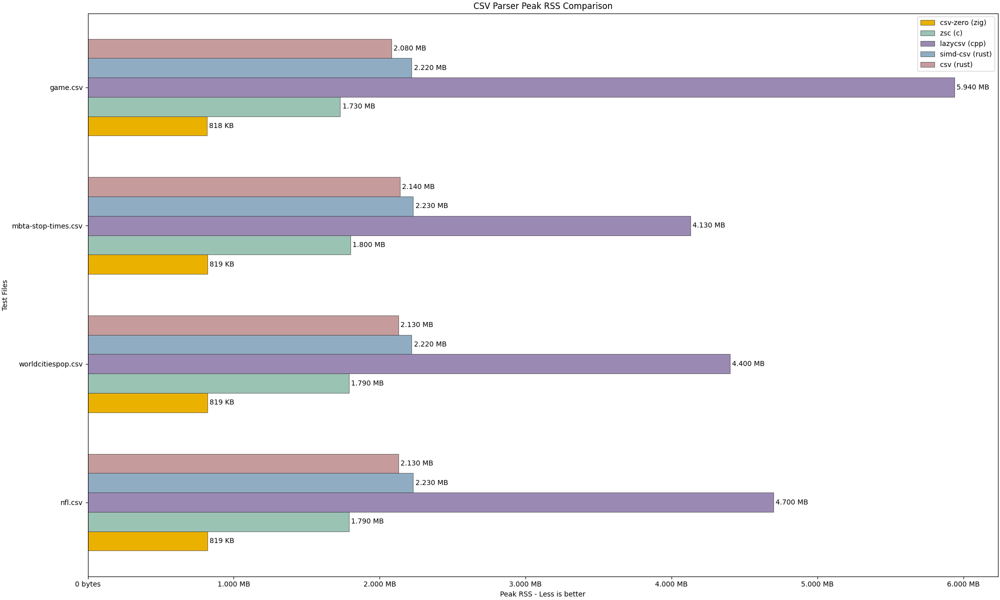
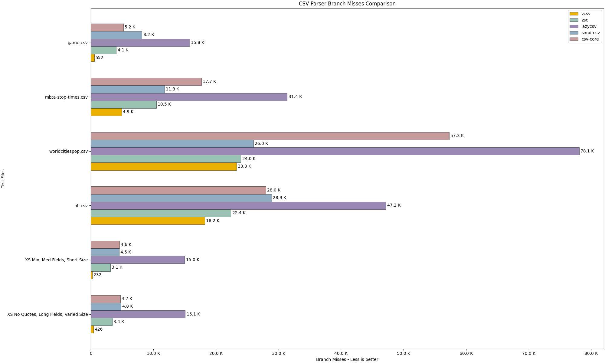
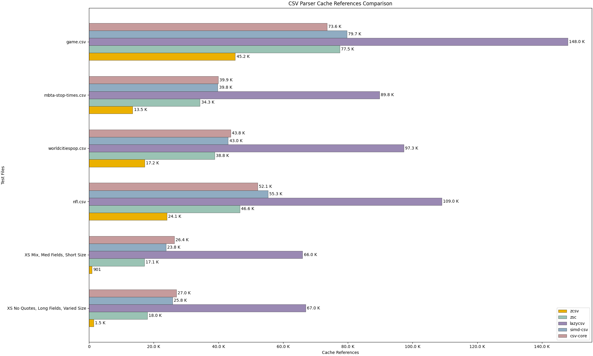
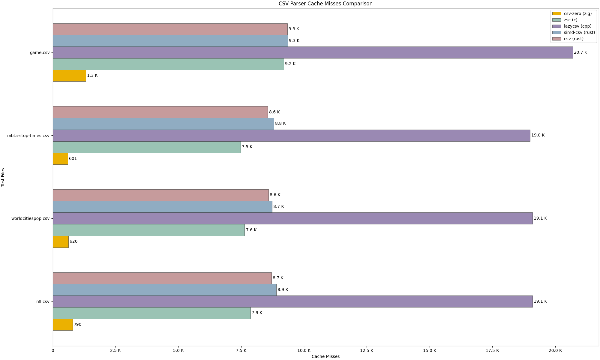

# CSV Race

Welcome to CSV Race repository!

I needed a repository to benchmark my CSV parser and fine tune it and also to monitor the behavior
of different parser with different outputs. I decided to prepare this repository to test CSV parsers from different
languages and compare them with a simple test case on various different types of files and see the results.

I would like this repository to evolve with all the new libraries that I'm sure will emerge and improve upon existing
parsers. The goal is to provide an easy way to benchmark for CSV parser authors or folks who want to find the
best parser for their task at hand. While I go over some of the benchmark data in the readme file. The repository
provides scripts and means for you to generate or use your own test data and your own set of libraries and generate
your own result. Refer to [Running the benchmarks](#running-the-benchmarks) to learn how to do this.

I have used this extensively while working on [csv-zero](https://github.com/peymanmortazavi/csv-zero) and it has proved helpful.

> It may be boring to read all the ways this benchmark is done but I invite you to read the [Benchmark
> Methodology](#benchmark-methodology) section before you look at the data.

## Benchmark Methodology

There are a lot of benchmark data out there and a lot of them are not done with the level of care necessary.
I would like to make it clear that despite the fact that I have tried to test these libraries with various different
file sizes and styles, which will be discussed shortly, you should not make decisions entirely by looking at these
charts and take further look into the libraries. They may handle your specific cases better, they may offer some
features or extra utilities that are simlpy not available in other libraries. Even if your goal is entirely
performance, you should examine the data and make sure the benchmark data reflects your specific needs, matches your
execution environment, etc.

> I have tried my best to choose various test cases, find best libraries out there and use them as they should
> be used. If you spot that I have made a mistake, please feel free to offer corrections or suggest a missing library.

### Task

This benchmark wants to focus on speed of iteration and not what consumers might want to do with that data. For this
reason, each parser must iterate and count the number of fields in a CSV file as fast as it can using only `64 KB`
buffer size. Some libraries might not provide a way to specify this, for those, we have not enforced a buffer size.

### Test Files

While searching for CSV files used for benchmarking, I came across some common files and decided that we should include
them. They are good general files to test files with a good mixture of quoted and non-quoted regions, with escapes and
different sizes. These files are perhaps closer to what a real-world csv file would be but if you are working with
larger data or delve into more specific cases, you might want to generate or use your own data and run the benchmark to
visualize benchmark data.

The four files are `game.csv`, `gtfs-mbta-stop-times.csv`, `nfl.csv` and `worldcitiespop.csv`.

There are also some files that are generated to test some other cases and their name follows this format:

`<size>_<mix|no>_quotes_<column-count>_col_<min-field-size>_<max-field-size>.csv`

Where `size` indicates the file size, `col` indicates how many columns are used.

The content of each field (cell) is generated by first randomly choosing a `len` in range (`min-field-size`,
`max-field-size`) and then randomly picking printable ASCII characters from range `32` to `127`.

If quotations are disabled (`no-quotes`), `"`, `\` and `,` characters never get included. Otherwise they can and if
they do, that field would get wrapped in `"` as a correct CSV file should.

- `xs_mix_quotes_12_col_0_32.csv`: X-Small (~1 KB), Mix of quoted fields, 12 columns, 0-32 chars in each field
- `xs_no_quotes_52_col_0_256.csv`: X-Small (~330 KB), No quoted fields, 52 columns, 0-256 chars in each field
- `m_mix_quotes_12_col_0_32.csv`: Medium (~102 M), Mix of quoted fields, 12 columns, 0-32 chars in each field
- `m_no_quotes_52_col_0_256.csv`: Medium (~32 M), No quoted fields, 52 columns, 0-256 chars in each field
- `xl_mix_quotes_2_col_0_12_many_rows.csv`: X-Large (~700 M) Mix of quoted fields, 2 columns, 0-12 chars in each field
- `xl_no_quotes_52_col_0_256.csv`: X-Large (~3.2 G) No quoted fields, 52 columns, 0-256 chars in each field
- `xl_mix_quotes_12_col_0_32.csv`: X-Large (~9.9 G) Mix of quoted fields, 12 columns, 0-32 chars in each field

### Data Points

The time it takes to complete the task is very important but we try to capture other important metrics as well.

- `Wall Time`: Wall time is the time it takes to really complete the task.
- `Peak RSS`: The peak resident set size (RSS) is the maximum portion of memory occupied by the parser process.
- `CPU Instructions`: Total number of machine-level instructions retired by the parser process during execution.
  This reflects the amount of work performed by the CPU, independent of clock speed.
- `CPU Cycles`: Total number of CPU clock cycles elapsed while executing the parser process.
  This includes cycles spent executing instructions as well as cycles stalled waiting on memory, branch resolution,
  or other microarchitectural events.
- `Cache References`: A cache reference is counted when the CPU attempts to access data via the cache hierarchy. In
  other words, events like memory access that went through cache system.
- `Cache Misses`: All cache misses across all levels (mostly LLC misses).
- `Branch Misses`: All branch mispredictions. If you are not familiar with this, reading [Branch predictor](https://en.wikipedia.org/wiki/Branch_predictor) might prove helpful.

### Tooling

[Poop](https://github.com/andrewrk/poop) is the tooling used to produce these metrics, which in turn is provided by
`perf`, a tool and a library used to provide CPU and hardware performance metrics. Unfortunately, `poop` only supports
linux. If you are using mac or Windows, you can use [Hyperfine](https://github.com/sharkdp/hyperfine) but it will only
provide you with wall time metrics. You can use `perf` or alternative tools.

### Data Visualization

A simple Python script is used to run the tests using `poop` to provide a CSV file and some figures of the metrics
stated above. You can re-purpose the script to use your own tooling or to tweak the charts.

## Benchmark Data

> The benchmark is measured using cpu `AMD Ryzen 5 PRO 5650U with Radeon Graphics`, `30 GB` memory on a linux
> operating system system `6.17.8-arch1-1`.

The result is indeed different for different computers and CPUs. I would love to provide visualizations for other CPU
architectures as well at some point, perhaps you can help with that!

> In order to reduce the noise, only the top 5 parsers are chosen. To see the raw numbers for each parser,
> refer to result-all.csv which includes every test case and every parser. The figures only include the 4 common csv
> files for the most part and the top 5 parsers in terms of their performance.

Let's get to the exciting bits!

### Wall Time

The figure below shows the wall time measurement of each parser for the 4 common test cases.


- You can see some interesting trends, such that the SIMD-accelerated CSV parser such as `simd-csv`, `zsv` and `csv-zero`
  all tend to have a harder time with `game.csv` even if they still beat other non-SIMD parsers, the gap is shortened.
  For instance, `zsc` performs really well in all other test cases but all of the sudden performs poorly for `game.csv`
  relative to what it delivers for other test cases.
- `lazycpp`, is the one with the most stability of performance, while it doesn't beat other parsers in many of the
  cases, it maintains a very good and consistent time.
- A surprising finding for me is that for `worldcitiespop.csv` where no quoted region exists, some parsers do worse
  such as `csv (rust)` and `lazycsv (cpp)`.

For this metric only, you can see the figure for larger files as well.



The results are fairly consistent here, the three parsers `zsc (c)`, `lazycsv (cpp)` and `simdcsv-rust` all perform
really well for all cases.

`csv-zero` performs really well in finishes first in all cases.

### Peak RSS

RSS, in simple terms is the amount of memory a process occupies. Peak RSS is the maximum of that value during the
execution of the process.



What I observe here is that all of the parsers hold a very similar amount of memory regardless of the file size. This
is true for all of the top 5 (though certainly not true for some of the parsers that did not make it to the top 5 list)
parsers save for `lazycsv (cpp)`. If you run this for the larger test cases, the process ends up taking Gigabytes of
memory, which can be problematic in some environments but the rest of the parsers handle quite large files without much
memory consumption.

### Branch misses

`if`, `switch` and statements alike, _often_ end up as a branch in the final application unless they get optimized away
by the compiler (or interpreter but no interpreted one ended up on the top 5 list unsurprisingly). When the processor
sees these conditions which involve a jump instruction at some point, it assumes an outcome and examines the next instructions based on that assumption.
If the outcome does not match what the CPU assumes, a branch miss event occurs and this can cause a noticeable impact on performance.
If there is a pattern, processors are really good at predicting the outcome but if there is no pattern, then these branch misses become a cause of slowdown. You can compare the parsers that have low branch misses and their wall-time
performance and see a correlation.



### Cache Misses & References




There are additional metrics that you can find in the `images` directory or when you run but I want to keep this
benchmark monitor for the most sought after ones.

## Running the benchmarks

### Required tools

- `Poop` (only available for linux) or `Hyperfine` (only includes wall-time metrics).
- Python(and matplotlib): to generate data visualization, otherwise not necessary.
- Zig(0.15.2): to build `csv-zero` if you are interested in including this one and also to generate random data.

### Building parsers

All of the parsers are inside `src`, the only exception is that `src/zig/src/data_gen.zig` file is not a parser, it's
used to generate random test data.

To compile everything, you need C, C++, Rust, Go and Zig installed but you can add/remove the parsers that are in the
race locally. If you want to test your own library but aren't interested in the Go parser, just use your own list.

You can use `make build_all` to build all of the targets. You might need to tweak the build scripts for some of them
but they are not very hard. Rust has an excellent package manager and most of the C++ ones are header only. The hardest
to install is `zsc (c)` and if you follow the instructions in their repo, you can build and install it from source in a
matter of minutes.

### Choosing the test cases and parsers

You might want to choose what parsers to compare against, what test cases to use, maybe even your own.

#### Data Visualization

`generate_charts.py` is a Python script to run the tests using `poop` and write an `output.csv` and some figures
inside `images` directory. I'd like to support mac at some point as well but this is not available today.

#### Hyperfine/Poop

If you'd like to see the numbers or use `hyperfine` because `poop` is not available in your environment. You can use
the make files, just update the list for the `hyperfine`, `poop` and `test` targets and then you can choose the test
file using TEST_FILE.

```sh
$ make hyperfine TEST_FILE=/path/to/my/own/file.csv
```
